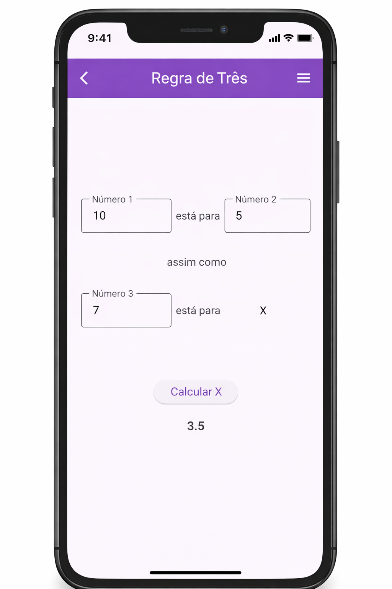

# 📱 Calculadora de Proporção em Flutter

Este é um projeto simples desenvolvido em Flutter que calcula uma proporção do tipo:

```
n1 está para n2 assim como n3 está para X
```

Ou seja:

```
X = (n2 * n3) / n1
```

---

## 🖼️ Tela do Aplicativo

<p align="center">
  
</p>

